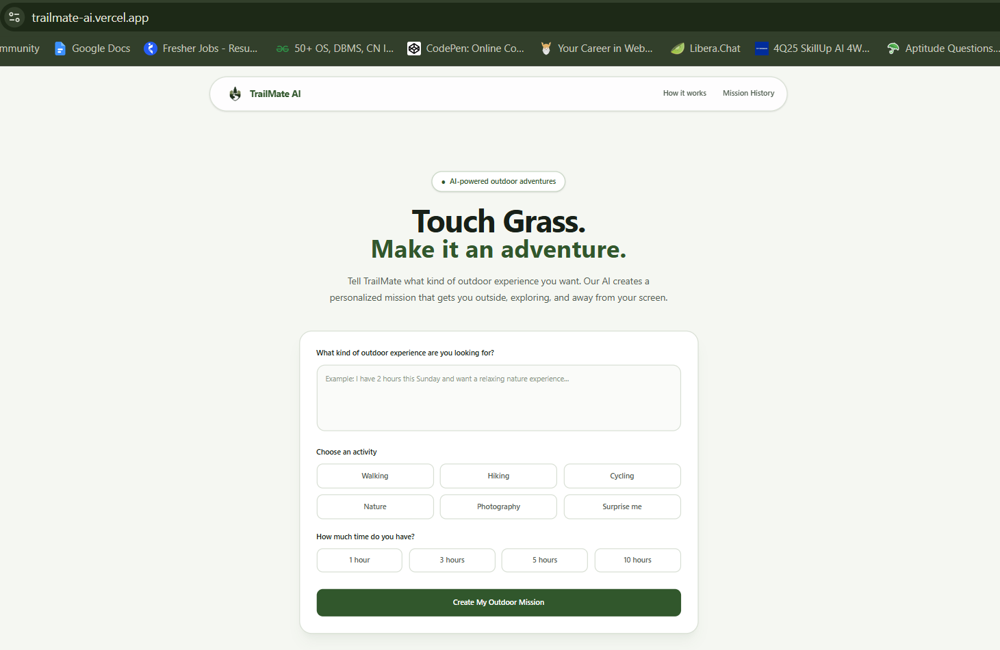
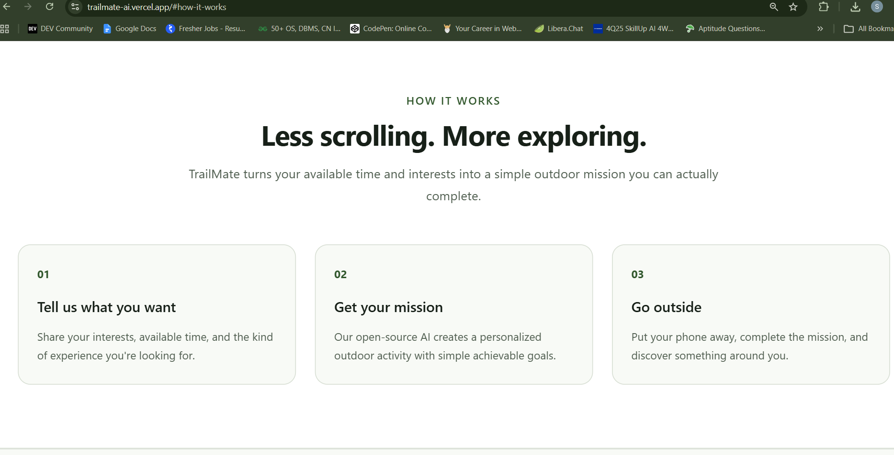
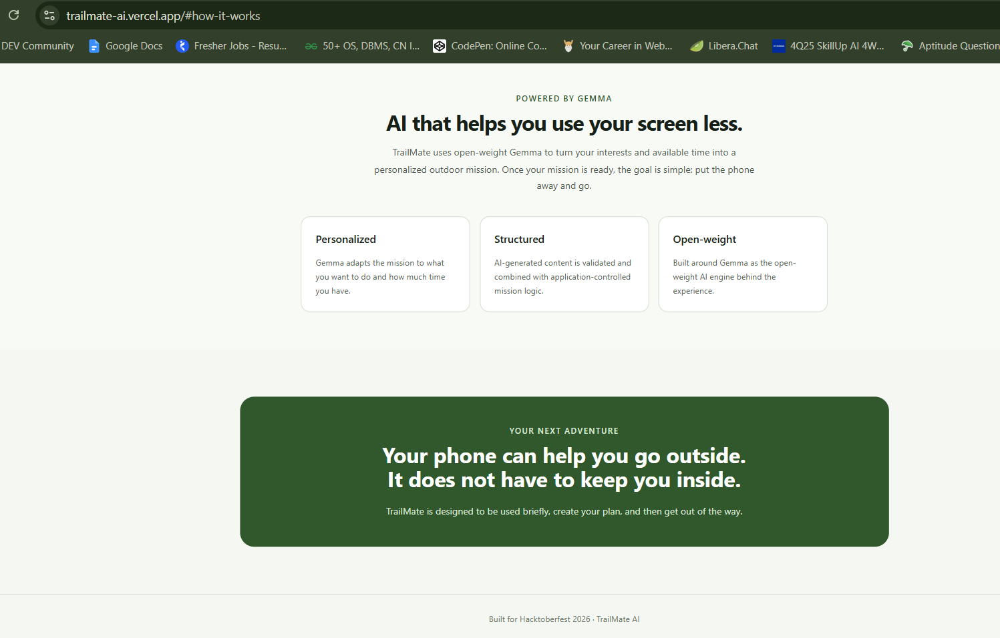
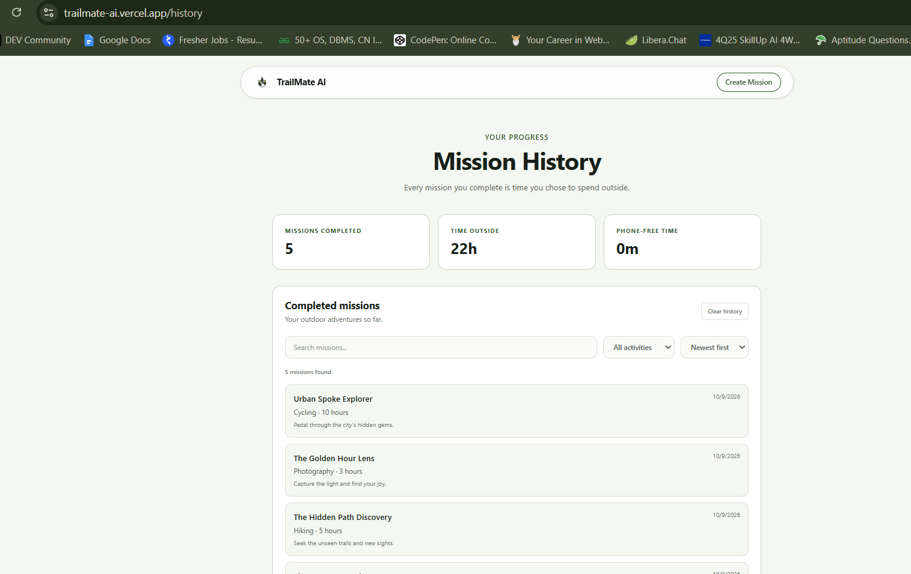

# 🌿 TrailMate AI

> **Touch Grass. Make It an Adventure.**

<p align="center">
  <a href="https://trailmate-ai.vercel.app/">
    <strong>🌿 Live Demo →</strong>
  </a>
</p>

<p align="center">
  An AI-powered outdoor companion that turns your time, interests, and activity into a personalized mission designed to get you off your screen and outside.
</p>

---

## 📌 Overview

**TrailMate AI** is an AI-powered outdoor companion built for the **DEV Community Hacktoberfest 2026 "Touch Grass" challenge**.

The idea is intentionally simple:

> **Use AI to help people spend less time using technology and more time experiencing the real world.**

Users provide a personal request, choose an outdoor activity, and select how much time they have.

TrailMate AI uses **Google's open-weight Gemma model** to transform that input into a personalized outdoor mission containing:

* 🎯 A unique mission
* 💡 A personalized reason for the recommendation
* 📝 A clear outdoor plan
* 🧭 Step-by-step activities
* 🌿 A nature challenge
* 📵 Phone-free guidance
* 🛡️ Safety tips
* ✅ Mission completion tracking
* 🏆 A completion score
* 📚 Personal mission history

The application is built around a deliberate contradiction:

> **The better TrailMate AI works, the less time you should spend using it.**

---

# 💡 The Problem

Our phones make it easier than ever to stay connected, entertained, and occupied.

But that convenience also makes it easy to spend hours indoors without realizing how much time has passed.

Many applications are designed to maximize:

* Screen time
* Notifications
* Engagement
* Repeated interactions
* Infinite scrolling

**TrailMate AI takes the opposite approach.**

Instead of using AI to keep users inside an application, it uses AI to create a personalized reason for them to **close the application and go outside**.

---

# 🌱 The Idea

The concept behind TrailMate AI is:

```text
What if AI didn't try to keep you online?

What if AI helped you get offline instead?
```

TrailMate AI transforms a simple intention such as:

```text
"I want something relaxing after work."
```

into an actionable outdoor experience.

A user can choose:

```text
Activity:
Photography

Duration:
1 hour
```

and let Gemma create a mission tailored to that context.

The result is not another content feed.

**It is a reason to leave the screen.**

---

# ⚙️ How It Works

TrailMate AI follows a complete end-to-end workflow:

```text
┌─────────────────────────┐
│      User Input         │
│                         │
│ Request + Activity +    │
│ Available Time          │
└────────────┬────────────┘
             │
             ▼
┌─────────────────────────┐
│       Gemma AI          │
│                         │
│ Generates personalized  │
│ mission content         │
└────────────┬────────────┘
             │
             ▼
┌─────────────────────────┐
│   Content Validation    │
│                         │
│ Validate AI-generated   │
│ content and structure   │
└────────────┬────────────┘
             │
             ▼
┌─────────────────────────┐
│ Deterministic Mission   │
│ Builder                 │
│                         │
│ Adds predictable rules, │
│ steps, difficulty,      │
│ preparation & safety    │
└────────────┬────────────┘
             │
             ▼
┌─────────────────────────┐
│    Outdoor Mission      │
│                         │
│ Personalized mission    │
│ presented to the user   │
└────────────┬────────────┘
             │
             ▼
┌─────────────────────────┐
│    Phone-Free Mode      │
│                         │
│ Start → Explore →       │
│ Complete → Disconnect   │
└────────────┬────────────┘
             │
             ▼
┌─────────────────────────┐
│   Mission Completion    │
│                         │
│ Steps + Nature +        │
│ Phone-Free participation│
└────────────┬────────────┘
             │
             ▼
┌─────────────────────────┐
│    Mission History      │
│                         │
│ Progress + Outdoor      │
│ Time + Phone-Free Time  │
└─────────────────────────┘
```

---

# ✨ Features

## 🤖 AI-Powered Outdoor Missions

Users can describe what they want from their outdoor experience.

Examples:

```text
"I want something peaceful."

"Give me a photography adventure."

"I have three hours this weekend."

"Something active but not too difficult."

"Surprise me."
```

TrailMate AI combines the user's request with the selected activity and duration before sending the relevant context to Gemma.

Each generated mission contains:

* Mission title
* Tagline
* Personalized reasoning
* Activity
* Duration
* Difficulty
* Mission summary
* Preparation checklist
* Three mission steps
* Nature challenge
* Phone-free tip
* Safety tips

---

## 💡 Personalized "Why This Mission?"

TrailMate AI doesn't simply generate a generic activity.

Every mission includes a dedicated:

### Why This Mission?

This explains how the generated experience fits the user's:

* Personal request
* Selected activity
* Available time

For example:

```text
This mission provides a focused photography
experience for a single hour of exploration
and observation.
```

This makes the AI recommendation feel intentional and personalized rather than arbitrary.

---

## 📵 Phone-Free Mode

Phone-Free Mode is one of the core ideas behind TrailMate AI.

Once a mission begins, users can start a phone-free session and focus on completing the outdoor experience instead of continuously interacting with the application.

The mode supports the core product philosophy:

```text
Generate the mission.
        ↓
Put the phone away.
        ↓
Go outside.
        ↓
Complete the mission.
```

TrailMate AI records the time spent in the phone-free session so outdoor progress can be measured.

---

## 🏆 Mission Completion Score

After completing the mission, TrailMate AI calculates a score out of 100.

The score rewards:

```text
Mission steps completed
        +
Nature challenge completion
        +
Phone-free participation
```

The completion experience intentionally ends with:

> **You touched grass. 🌿**

The score provides lightweight motivation without turning outdoor activity into another endless digital competition.

The real achievement is:

> **The time you chose to spend outside.**

---

## 📚 Mission History

Completed missions are stored locally in the browser.

The Mission History dashboard tracks:

* Missions completed
* Total time outside
* Total phone-free time
* Individual completed missions
* Completion dates

Users can search and organize previous missions using:

### Search

Search by:

* Mission title
* Activity
* Tagline

### Activity Filter

Filter by:

* All activities
* Walking
* Hiking
* Cycling
* Nature
* Photography

### Sorting

Sort by:

* Newest first
* Oldest first
* Title A–Z
* Title Z–A

History can also be cleared when desired.

---

# 🖥️ Screenshots

## 🏠 Home

The landing page introduces the TrailMate AI concept and allows users to configure their outdoor mission.

<p align="center">
  
</p>

---

## ⚙️ How it works

Users provide their request, choose an activity, select their available time, and generate a personalized outdoor mission.

<p align="center">
  
</p>

---

## 🤖 Gemma-Powered Mission

Gemma generates the creative and personalized components of the outdoor experience, which are then combined with deterministic application logic.

<p align="center">
  
</p>

---

## 📚 Mission History

The history dashboard provides an overview of completed missions, outdoor time, phone-free time, search, filtering, and sorting.

<p align="center">
  
</p>

---

# 🧠 Built with Gemma

Gemma is the core AI component of TrailMate AI.

The application uses:

**Gemma 4 26B A4B IT**

to generate the creative and personalized parts of each outdoor mission.

The model is not treated as a replacement for application logic.

Instead, TrailMate AI gives Gemma a focused responsibility:

> **Generate useful, personalized outdoor experiences.**

The application handles predictable structure and business rules itself.

---

# 🧠 AI Architecture

## Why Gemma?

Gemma is a natural fit for TrailMate AI because the project needs an AI model capable of generating **varied, personalized, natural-language outdoor experiences** while aligning with the challenge's focus on **open-weight AI**.

Instead of relying on a fixed collection of predefined activities, Gemma allows TrailMate AI to dynamically create different missions based on the user's **intent, selected activity, and available time**.

For example, the same:

```text
Activity: Photography
Duration: 1 hour
```

can produce completely different experiences depending on whether the user asks for something peaceful, adventurous, creative, challenging, or relaxing.

This makes Gemma responsible for the part AI is best suited for:

> **Turning user intent into a creative and personalized outdoor experience.**

---

## 🏗️ AI Architecture

A key engineering decision in TrailMate AI is the separation between **generative AI content** and **deterministic application logic**.

Instead of asking Gemma to generate the entire deeply nested mission object, the application asks the model to generate a small set of focused creative fields.

Gemma generates content such as:

```text
title
whyThisMission
tagline
summary
step1
step2
step3
natureChallenge
phoneFreeTip
```

The application then validates this content and constructs the complete mission using predictable application rules.

This keeps the AI layer focused on **creativity and personalization**, while the application remains responsible for **structure, consistency, and business logic**.

---

## 🔄 AI Generation Pipeline

```text
User Request
     │
     ▼
Prompt Construction
     │
     ▼
Gemma
     │
     ▼
Structured AI Content
     │
     ▼
Validation
     │
     ├── Required fields
     ├── Non-empty content
     ├── Repeated-content detection
     └── Invalid-response detection
     │
     ▼
Deterministic Mission Builder
     │
     ├── Step durations
     ├── Difficulty
     ├── Preparation
     ├── Safety tips
     └── Mission structure
     │
     ▼
Validated Outdoor Mission
     │
     ▼
User
```

---

## Why Separate AI from Deterministic Logic?

Generative AI is well suited for:

* ✨ Creative writing
* 🎯 Personalization
* 💬 Natural-language generation
* 🔄 Generating varied experiences

Application code is better suited for:

* ⏱️ Predictable durations
* 📊 Difficulty rules
* 🧩 Required structure
* 🛡️ Safety defaults
* ✅ Data validation
* 🔄 Application state

TrailMate AI combines both:

```text
AI
+
Deterministic Logic
+
Validation
=
Reliable Personalized Experience
```

This separation prevents the model from becoming responsible for every application rule and makes the overall system more predictable and maintainable.

---

# 🧪 Example Mission

Suppose a user enters:

```text
Request:
I want something peaceful after a stressful day.

Activity:
Photography

Duration:
1 hour
```

Gemma can transform the request into creative mission content such as:

```text
Lens of the Wild

Capture the small details.

Spend an hour slowing down and observing
textures, light, plants, and small moments
around you.
```

The application then combines that AI-generated content with deterministic mission rules:

```text
Activity:
Photography

Duration:
1 hour

Difficulty:
Easy
```

### Mission

```text
1. Find a quiet outdoor location.

2. Photograph five overlooked details.

3. Finish with one intentional photo.
```

### Nature Challenge

```text
Find one natural pattern you would normally
walk past without noticing.
```

### Phone-Free Tip

```text
Put your phone away between photographs
and focus on what is around you.
```

The important part is that the mission is **not hardcoded**.

The same activity and duration can produce a different experience when the user's request changes.

---

# 🛠️ Technical Implementation

## Frontend

TrailMate AI uses the **Next.js App Router** with React and TypeScript.

The frontend manages:

* User input
* Activity selection
* Duration selection
* Mission generation
* Mission display
* Step completion
* Phone-Free Mode
* Mission scoring
* Mission history

---

## Backend

AI generation is handled through a dedicated Next.js server route:

```text
app/api/generate-mission/route.ts
```

The client sends the user's mission requirements to the server.

The server then:

1. Builds the Gemma prompt.
2. Calls the Gemma API.
3. Parses and validates the response.
4. Checks the generated content for invalid or repeated data.
5. Builds the final mission structure using deterministic rules.
6. Returns the validated mission to the client.

Keeping this logic on the server also prevents the AI API key from being exposed to client-side code.

---

# 💾 Data Storage

TrailMate AI currently uses browser `localStorage` for mission history.

This keeps the application lightweight and removes the need for:

* User accounts
* Database infrastructure
* Authentication
* Backend persistence for history

The stored history includes:

```text
Mission
Completed date
Phone-free minutes
```

This approach is appropriate for the current challenge scope because the core experience does not require an account or cloud-based history.

Because the data is stored locally:

* Clearing browser storage removes saved missions.
* History does not automatically transfer between devices.
* Different browsers maintain separate histories.
* No account is required to track local progress.

---

# 🎨 Design Philosophy

TrailMate AI is intentionally designed **not to become another application demanding the user's attention**.

The user journey is:

```text
Choose
   ↓
Generate
   ↓
Go Outside
   ↓
Disconnect
   ↓
Complete
   ↓
Reflect
```

The interface provides only the information needed to begin and complete the mission.

Once the mission starts, the product encourages the user to stop interacting with the interface and focus on the real-world experience.

This creates a fundamentally different product philosophy from traditional engagement-focused applications.

---

# 🌎 What Makes TrailMate AI Different?

Most AI products try to answer:

> "How can we make users spend more time with our product?"

TrailMate AI asks:

> **"How can AI help users spend less time with our product?"**

That distinction is at the center of the application.

**Gemma** provides personalization.

**TrailMate AI** provides structure.

**Phone-Free Mode** encourages disconnection.

**Mission History** measures progress.

**The outdoors is the actual destination.**

---

# 🧰 Tech Stack

| Category       | Technology                |
| -------------- | ------------------------- |
| Framework      | Next.js 16                |
| UI             | React 19                  |
| Language       | TypeScript                |
| Styling        | Tailwind CSS              |
| Architecture   | Next.js App Router        |
| API            | Next.js Route Handlers    |
| AI Model       | Google Gemma 4 26B A4B IT |
| AI SDK         | `@google/genai`           |
| AI Platform    | Google AI Studio          |
| Client Storage | Browser `localStorage`    |
| Deployment     | Vercel                    |

---

# 📁 Project Structure

```text
trailmate_ai/
│
├── app/
│   ├── api/
│   │   └── generate-mission/
│   │       └── route.ts
│   │
│   ├── history/
│   │   └── page.tsx
│   │
│   ├── globals.css
│   ├── layout.tsx
│   └── page.tsx
│
├── public/
│   ├── screenshots/
│   │   ├── Home.png
│   │   ├── Working.png
│   │   ├── Gemma.png
│   │   └── History.png
│   │
│   └── logo.png
│
├── types/
│   ├── history.ts
│   └── mission.ts
│
├── .env.local
├── .gitignore
├── package.json
├── package-lock.json
└── README.md
```

---

# 🚀 Getting Started

## Prerequisites

Make sure you have:

* Node.js 20+
* npm
* A Google AI Studio API key

---

## Clone the Repository

```bash
git clone https://github.com/shrutikotgire0129/Trailmate_AI.git
cd Trailmate_AI
```

---

## Install Dependencies

```bash
npm install
```

---

## Configure Environment Variables

Create a `.env.local` file in the project root:

```env
GEMINI_API_KEY=your_google_ai_studio_api_key
```

> ⚠️ Never commit your API key to GitHub.

---

## Run the Development Server

```bash
npm run dev
# or
yarn dev
# or
pnpm dev
# or
bun dev
```

Open [http://localhost:3000](http://localhost:3000) with your browser to see the result.

You can start editing the page by modifying `app/page.tsx`. The page auto-updates as you edit the file.

This project uses [`next/font`](https://nextjs.org/docs/app/building-your-application/optimizing/fonts) to automatically optimize and load [Geist](https://vercel.com/font), a new font family for Vercel.

## Learn More

To learn more about Next.js, take a look at the following resources:

- [Next.js Documentation](https://nextjs.org/docs) - learn about Next.js features and API.
- [Learn Next.js](https://nextjs.org/learn) - an interactive Next.js tutorial.

You can check out [the Next.js GitHub repository](https://github.com/vercel/next.js) - your feedback and contributions are welcome!

## Deploy on Vercel

The easiest way to deploy your Next.js app is to use the [Vercel Platform](https://vercel.com/new?utm_medium=default-template&filter=next.js&utm_source=create-next-app&utm_campaign=create-next-app-readme) from the creators of Next.js.

Check out our [Next.js deployment documentation](https://nextjs.org/docs/app/building-your-application/deploying) for more details.
